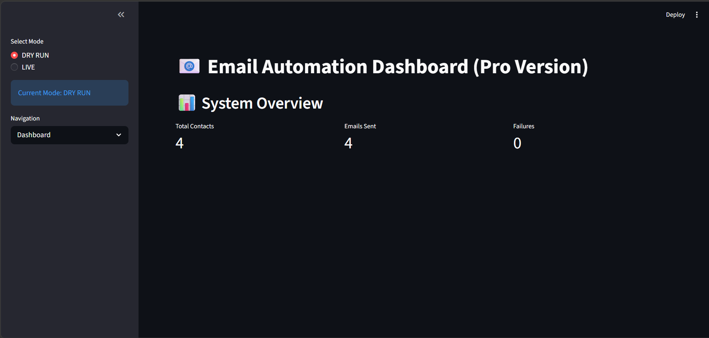
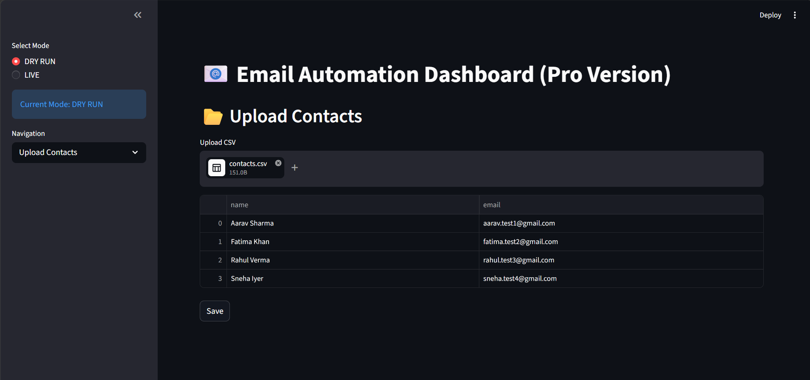
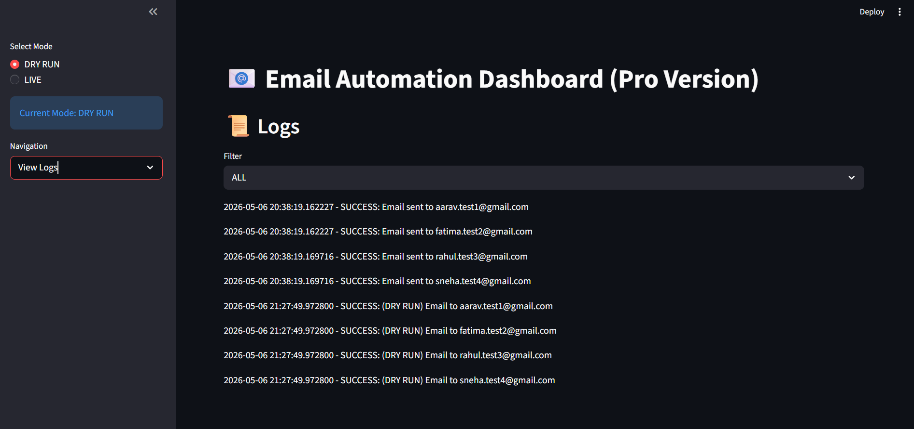
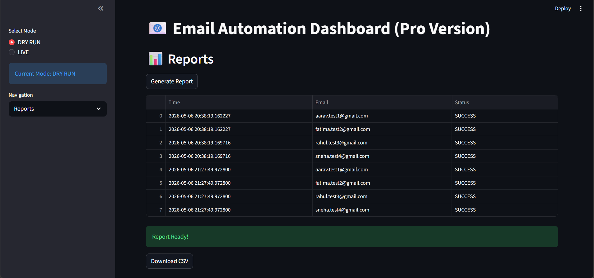

 Email Automation & Reminder System

A Python-based system that automates sending emails, schedules reminders, and tracks delivery status using CSV data, SMTP, and a Streamlit dashboard.

---

 Features

-  Upload contact list (CSV)
-  Create email templates with personalization
-  Bulk email sending (DRY RUN + LIVE mode)
-  Schedule reminders
-  View logs (success / failure)
-  Generate CSV reports
-  Interactive Streamlit dashboard
-  Secure credential handling using `.env`

---

  Project Workflow

Contacts CSV → Template → Personalization → Email Sending → Logs → Report


---

 Tech Stack

- Python
- Pandas
- smtplib
- email.message
- Streamlit
- FastAPI (optional)
- schedule / datetime
- logging
- python-dotenv

---

  Project Structure
Email-Automation-Reminder-System/
```
│
├── data/
│ ├── contacts.csv
│ └── reminders.csv
│
├── templates/
│ └── email_template.txt
│
├── src/
│ ├── email_sender.py
│ ├── scheduler.py
│ ├── utils.py
│ ├── logger.py
│ └── config.py
│
│ 
│
├── logs/
│ └── email_logs.txt
│
│
├── .env
├── .gitignore
├── requirements.txt
└── main.py
├── app.py

```

---
Dashboard Features

- Upload contacts
- Create email campaigns
- Send emails (Dry Run / Live)
- View logs
- Generate reports


 Screenshots

 Dashboard


 Upload Contacts


 Logs


 Report



 Security
- Credentials stored in .env
- .env excluded using .gitignore
- No sensitive data uploaded


 Real-World Use Cases
- HR interview reminders
- Payment notifications
- Task alerts
- Marketing campaigns
- Webinar reminders


 Learning Outcomes
- Python automation
- Email systems using SMTP
- Scheduling jobs
- API development (FastAPI)
- Dashboard creation (Streamlit)
- Logging and reporting


 Important Notes
- Use Gmail App Password (not your real password)
- Check spam folder if email not visible
- Never upload .env to GitHub
